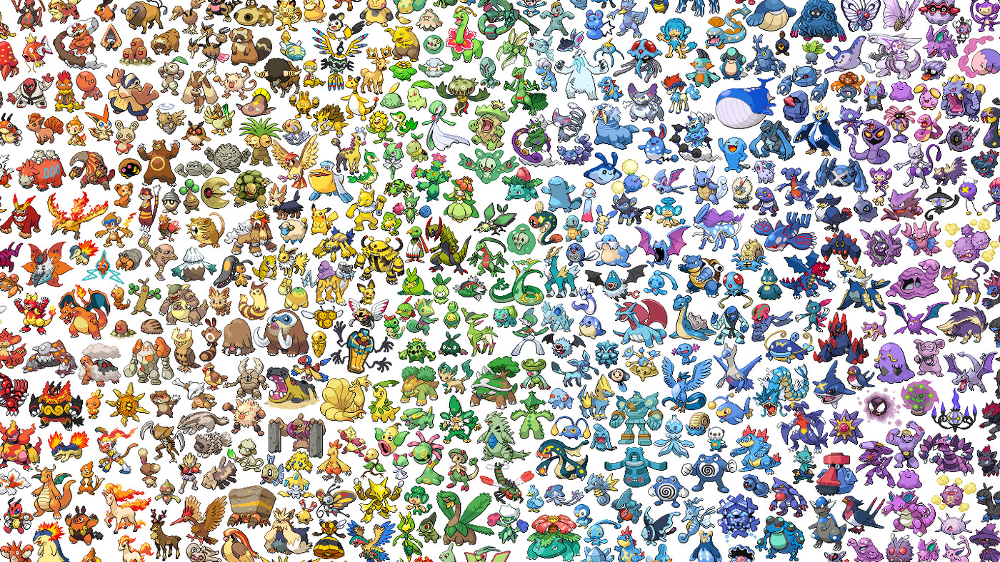
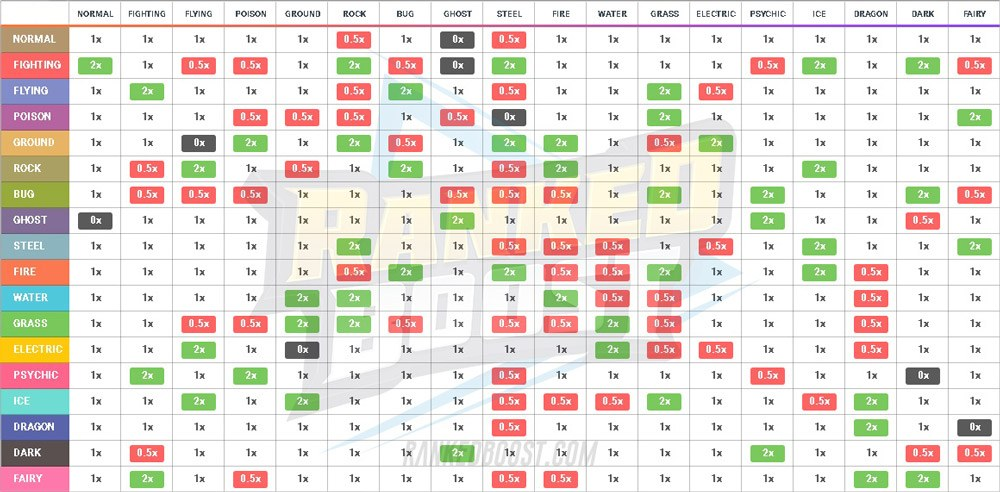
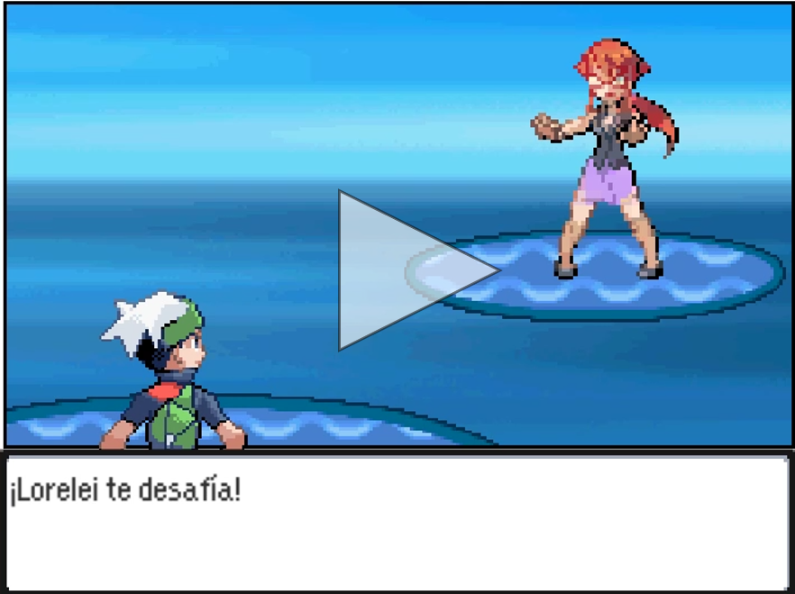
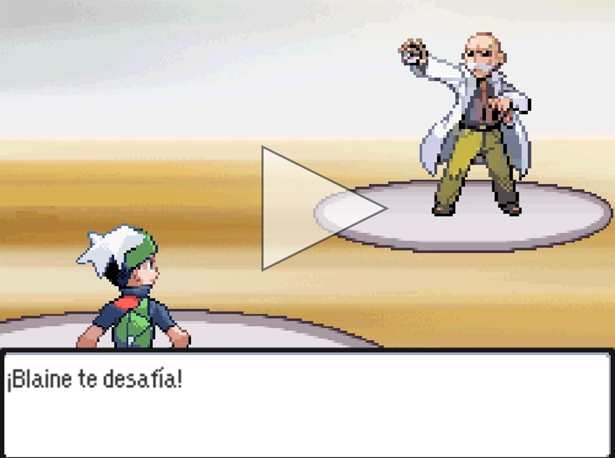
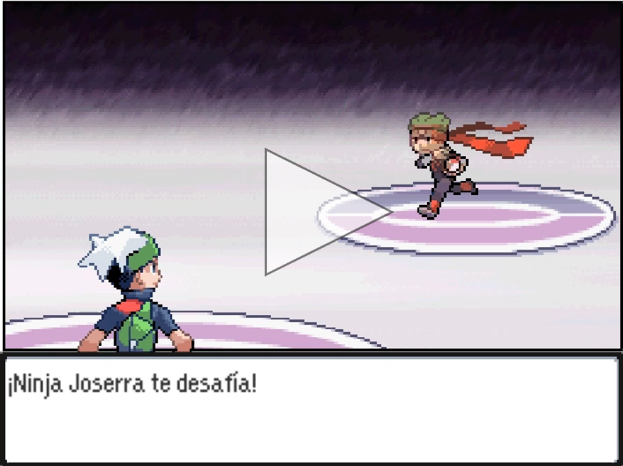
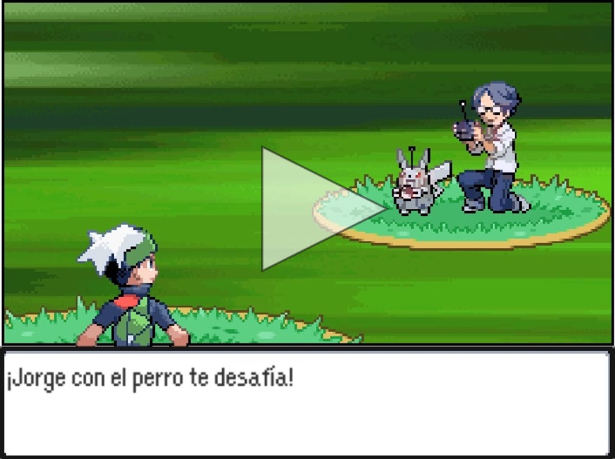
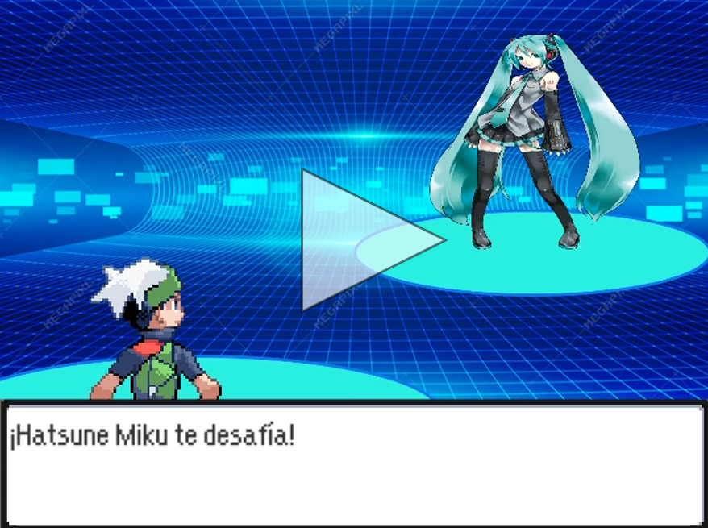
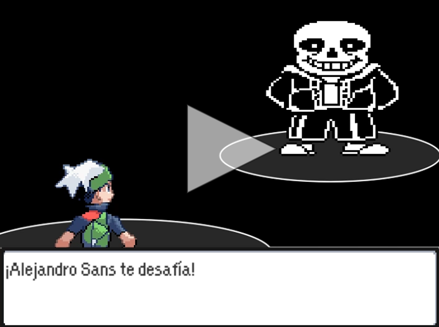

# Pokémon: Modo dIAblo
Proyecto final para la asignatura de IAV - 3ºGDV UCM, realizado por Álvar Domingo, Pablo Jurado y Miguel Mur

---

# Introducción:
Pokémon es una famosa saga de videojuegos de rol por turnos en la que el jugador controla a una simpática serie de criaturas en distintas batallas. Desde su primera aparición, en el año 1996, la saga Pokémon ha conquistado los corazones (y las carteras) de jugadores de todo el mundo.

La mecánica de los videojuegos es aparentemente sencilla, aunque se le han ido añadiendo diversas capas de complejidad añadida. Cada jugador puede tener en su equipo hasta 6 Pokémon de forma simultánea, con uno solo activo dentro de la batalla (aunque en algunas ocasiones también se pueden tener más, nosotros nos centraremos en las batallas 1vs1). En cada turno, el jugador podrá ordenarle a su Pokémon que realice un ataque o cambiar al Pokémon activo por otro que siga con vida. El objetivo es quitarle todos los puntos de vida a todos los Pokémon del contrincante para alzarnos con la victoria.

---

# Mecánicas principales:

## Los Pokémon:
Cada Pokémon tiene su propio conjunto de estadísticas:

- **Ataque:** Determina el número de puntos de daño que infligirán los ataques de tipo físico.
- **Ataque especial:** Determina el número de puntos de daño que infligirán los ataques de tipo especial.
- **Defensa:** Determina la resistencia que tendrá el Pokémon a los ataques de tipo físico.
- **Defensa especial:** Determina la resistencia que tendrá el Pokémon a los ataques de tipo especial.
- **Velocidad:** Determina la prioridad que tendrán los ataques del Pokémon sobre los del rival. (esto puede variar dependiendo del ataque)
- **HP:** Los puntos de vida máximos con los que cuenta el Pokémon.

Además, cada Pokémon es de uno (o dos) tipos distintos, que determinarán la efectividad de sus ataques y su resistencia ante los ataques del contrincante.

La relación entre los tipos es muy sencilla. Un tipo puede ser muy eficaz ofensivamente contra otro (Fuego es muy efectivo contra planta), pero también pueden ser muy resistentes defensivamente contra otros (Acero resiste ataques de tipo roca).

---

## Movimientos:

Los movimientos son los ataques que realizarán los Pokémon para obtener victoria en batalla. Cada Pokémon puede conocer hasta 4 movimientos.

- **Poder:** Determina el daño que hace un movimiento.
- **Tipo:** Este puede ser o físico o especial:
    - **Físico:** El movimientos utilizará la estadística de Ataque del usuario y el daño se calculará con la defensa del enemigo. *(Ej: Placaje)*
    - **Especial:** El movimientos utilizará la estadística de Ataque Especial del usuario y el daño se calculará con la defensa especial del enemigo. *(Ej: Rayo burbuja)*
- **PP:** Determina las veces que se puede utilizar un ataque.
- **Condicion:** Hay ataques que aplicarán una condición de estado al enemigo *(Sueño, Parálisis, Confusión...)*
- **Boost:** Algunos movimientos aumentan o disminuyen las estadísticas de los Pokémon. Pueden servir para volver más fuerte a tu Pokémon o debilitar el del rival *(Ej: Danza Dragon - +Ataque y +Velocidad al usuario)*

No todos los movimientos cumplen estas simples reglas. Hay ciertos movimientos con interacciones especiales. Hiperrayo es un ataque muy poderoso que te impide atacar al turno siguiente. Danza lluvia debilita los ataques de tipo fuego por 5 turnos y potencia los de agua...

Para lo que queremos demostrar en esta práctica la mayoría de estos movimientos no nos hacían falta, así que hemos implementado los movimientos "simples" con la excepción de descanso. Este movimiento duerme al usuario por 2 turnos y cura su salud completamente.

---

## Condiciones de estado:

Cada Pokémon podrá ser afectado por solo una condición de estado a la vez.

- **Sueño:** El Pokémon quedará inutilizado de 1 a 3 turnos y no podrá atacar.
- **Parálisis:** Tras elegir un ataque, el Pokémon tendrá un 25% de probabilidades de paralizarse completamente y perder el turno. También reduce la velocidad del Pokémon a un 25%. Dura indefinidamente.
- **Congelamiento:** El Pokémon quedará inutilizado hasta que se acabe el congelamiento. En cada turno tiene un 25% de probabilidades de romperlo.
- **Envenenamiento:** Al final del turno, el Pokémon perderá 1/8 de su vida máxima. Dura indefinidamente.
- **Tóxico:** Funciona de forma similar al Envenenamiento pero en cada turno quita el doble de daño. También dura indefinidamente.
- **Quemadura:** Al final del turno, el Pokémon perderá 1/16 de su vida máxima. También reduce el ataque físico del Pokémon a la mitad. Dura indefinidamente.
- **Confusión:** Tras seleccionar un movimiento, el usuario tiene un 25% de probabilidades de perder el turno y golpearse a sí mismo. Dura de 1 a 4 turnos. Es la única condición de estado que es volátil, lo que quiere decir que puede aplicarse junto a las demás y se cura al cambiar de Pokémon.

## Objetos:

El entrenador rival podrá hacer uso de una cantidad de objetos limitados. El jugador no podrá utilizarlos porque solo los noobs usan objetos. (Y era un poco complicado de implementar)

Estos objetos tiene usos tan variados como la cantidad de Pokémon en la saga. Por simplicidad solo hemos añadido 2 objetos que usarán los enemigos:

- **Cura total:** Cura cualquier condición de estado que sufra un Pokémon en el campo de batalla.
- **Poción Máxima:** Cura completamente los HP de un Pokémon en el campo de batalla.

---

# Planteamiento del proyecto:

El proyecto consistiría en hacer 2 IA’s de Pokémon: 
- **IA Simple:** Replicará la IA de combate de los jefes de los primeros juegos de Pokémon.
- **IA Mejorada:** Mejorará en todos los aspectos el comportamiento de la IA Simple. Considerará, entre varias cosas:
    - Cambio inteligente entre Pokémon.
    - Uso mejorado de objetos.
    - Predicción de intercambio de Pokémon del rival.
    - Elección inteligente de movimientos.

Para demostrar la efectividad de las IA's, se dispone de varios combates que constarán de dos versiones: Una con la IA simple y otra con la mejorada.
Estos combates están diseñados para mostrar los fallos evidenes de diseño de la IA Simple y como la IA Mejorada los cubre.

También hemos añadido una "pelea final" en la que el usuario se enfrentará a un duro combate. Esta pelea también se podrá afrontar contra la IA Simple o la Mejorada.

# **Los combates:**

En este apartado se explicarán todos los ejemplos, exponiendo los fallos de la IA Simple y como hemos mejorado estos comportamientos en la IA Mejorada.

## **Lorelei y el uso de movimientos:**

### **Contexto:**

Este temible miembro del alto mando es el primer obstáculo entre el Jugador y la conquista de la Liga Pokémon en la primera generación de la saga. Su equipo consta de varios Pokémon de tipo hielo y agua, que supondrán un obstáculo ante entrenadores que prefieran Pokémon de tipo Fuego o Roca. Lamentablemente, Lorelei también es conocida por ser uno de los jefes más abusables de toda la saga Pokémon.

En la primera generación, los entrenadores siempre eligen un movimiento cuyo tipo sea super-efectivo contra uno de los tipos del Pokémon rival. Esta estrategia puede llegar a ser infalible en ciertas ocasiones, pero no todos los movimientos son ofensivos.

Su Dewgong conoce Descanso, un ataque de tipo psíquico que duerme al usuario y le restaura completamente todos los puntos de vida. Si este Dewgong se enfrenta ante un Pokémon de tipo Lucha, siempre utilizará este movimiento, aunque tenga la vida al máximo o sepa que no hace daño.

Esto es muy fácil de abusar, ya que si tienes un Pokémon de tipo Lucha con un ataque para incrementar tus estadísticas (Danza Espada) puedes usarlo constantemente contra Dewgong y posteriormente barrer el equipo enemigo.

A continuación se puede ver un vídeo de la batalla contra la IA básica:

### **Mejora:**

Utilizar siempre el movimiento con ventaja de tipo no tiene sentido. 

Por ello, en cada turno, hemos hecho que el Pokémon itere por sus movimientos y "simule" el daño que le haría cada uno al rival. Se guarda el que más daño hace y entonces, lo utiliza.

Para el uso de movimientos de condición de estado (Parálisis, Confusión...), lo óptimo es utilizarlos cuando el usuario esté alto de vida y el enemigo no esté sufriendo ya una Condición de Estado. Intentar paralizar al enemigo cuando ya está paralizado es regalar un turno.

Las mejoras de stats también siguen esta regla. Bajarle la defensa al rival o subir nuesto ataque se aprovecha más cuando el usuario está alto de vida. Además, no tiene mucho sentido usar movimientos de cambio de stats más de una o dos veces porque el oponente puede aprovechar estos turnos para subir sus propios stats o derrotar a nuestro Pokémon.

En el caso de Descanso, nos interesa utilizarlo cuando el usuario está bajo de vida para aprovecharlo al máximo.

En resumen:

- Cuando el Pokémon tiene mucha vida: Favorece mejoras de estadísticas y aplicar condiciones de estado al rival.
- Cuando el Pokémon tiene vida media: Utilizará el ataque más poderoso.
- Cuando el Pokémon tiene poca vida: Utilizará movimientos que restauren su vida.

### **Combate:**

Lorelei usará dos de sus icónicos Pokémon: Dewgong con Descanso y un Lapras.

El equipo del jugador consistirá de varios Pokémon, entre ellos Heracross, que tendrá que utilizar contra Dewgong para abusar de su IA y alzarse con la victoria.

A continuación se puede ver un vídeo de la batalla contra la IA mejorada:

---

## **Blaine y el uso de objetos:**

### **Contexto:**

Blaine es el penúltimo líder de gimnasio de la región de Kanto. Experto en ataques de tipo fuego, lanzará llamarada tras llamarada contra el jugador. Los entrenadores que favorezcan Pokémon de tipo Planta o Bicho pasarán un mal rato contra él.

Por desgracia, lo que destaca en el conocimiento de Pokémon de tipo fuego, carece en el uso de objetos.

En la primera Generación, cada jefe tenía su manera peculiar de utilizar objetos, pero Blaine es el peor con diferencia. En cada turno, Blaine tiene un 25% de probabilidades de utilizar una Poción Máxima, ignorando complétamente si su Pokémon esté sano o no. Si utiliza una de estas pociones con un Pokémon al máximo de vida, perderá el turno.

A continuación se puede ver un vídeo de la batalla contra la IA básica:

### **Mejora:**

La mejora de este comportamiento es bastante sencilla. 

La IA mejorada utilizará una Poción Máxima cuando su Pokémon esté a menos del 30% de vida. También utilizará una Cura Total cuando su Pokémon sufra una condición de estado y su Pokémon tenga un 80% de la vida o más (ya que no tiene mucho sentido curar a un Pokémon de su estado si va a ser derrotado inmediatamente después).

### **Combate:**

En este ejemplo, Blaine usará el equipo que empleaba en los juegos originales.

El equipo del jugador consistirá de varios Pokémon que formaban parte de la mayoría de entrenadores Pokémon de la época.

A continuación se puede ver un vídeo de la batalla contra la IA mejorada:

---

## **Ninja Joserra y los movimientos con Prioridad:**

### **Contexto:**

Como se explicó en el ejemplo de Lorelei, la selección de movimientos era muy básica en los juegos originales.

Como está implementada la IA hasta este momento, busca el ataque más poderoso en cada turno. Sin embargo, hay ocasiones en las que nos interesará utilizar un ataque con prioridad (un ataque de prioridad 1 siempre irá antes que un ataque de prioridad 0 aunque el usuario sea más lento).

En este ejemplo se plantea esta posible situación. El enemigo tiene un grovyle que derrotará a nuestro milotic con 2 Hojas Afiladas. Sin embargo, como es más lento que nosotros, le derrotaremos con 2 Rayos Hielo.

Si en el segundo turno el Grovyle utilizara Ataque Rápido en vez del ataque que hace más daño, se alzaría con la victoria.

A continuación se puede ver un vídeo de la batalla contra la IA básica:

### **Mejora:**

La mejora de este comportamiento es algo más compleja, pero efectiva.

Cuando iteramos sobre los movimientos del usuario para calcular el movimiento más letal, comprobamos si este ataque derrotaría al enemigo, y distinguimos dos posibles casos:

- **Si el ataque derrota al enemigo y no tiene prioridad:** Lo añadimos a un vector de ataques que derrotan al enemigo. Al finalizar el recorrido, utilizamos un movimiento aleatorio de uno de estos ataques.

    El razonamiento es bastante simple. Si derrotamos al oponente con 3 ataques distintos, nos da completamente igual cual utilizar. Si siempre utilizamos el más poderoso sería muy predecible y el oponente podría cambiar de Pokémon a uno con inmunidad a ese ataque en concreto.

- **Si el ataque derrota al enemigo y tiene prioridad:** Ignoramos cualquier otro movimiento que derrote al enemigo y siempre utilizamos este ataque. El enemigo tendría que cambiar de Pokémon o perder el actual. 

Si ninguno de los ataques disponibles consigue derrotar al enemigo, elegiremos el ataque  que más vida le quite al oponente como se explicó anteriormente.

### **Combate:**

Como se explicaba en el primer apartado, el oponente tendrá un único Grovyle con Hoja Afilada y Ataque Rápido.

El jugador dispondrá de un rápido Milotic con Rayo Hielo.

A continuación se puede ver un vídeo de la batalla contra la IA mejorada:

---

## **Jorge con el Perro y detección de intercambios de Pokémon:**

### **Contexto:**

Este ejemplo es de los más extraños, pero es de los fallos que más se explotan en Speedruns o retos Nuzlocke de Pokémon.

Hay ciertos tipos que tienen inmunidad defensiva ante distintos tipos (Volador es inmune a ataques de tipo Tierra y Tierra es inmune a ataques de tipo eléctrico).

Si la IA siempre usa ataques con ventaja de tipo, podemos predecir estos intercambios fácilmente y si el enemigo está envenenado, conseguir derrotar a enemigos con una estrategia bastante sucia.

A continuación se puede ver un vídeo de la batalla contra la IA básica:

### **Mejora:**

Para mejorar este comportamiento, cada vez seguida que el oponente cambie a un Pokémon, la IA lo detectará. Si el oponente lo hace 3 veces seguidas, calculará el ataque más efectivo no sobre el Pokémon que está ahora en el campo de batalla, sino contra el que la IA predice que va a sacar.

Si el Pokémon de la IA derrota a un oponente o el enemigo ataca, se reinicia el contador. 

### **Combate:**

En este combate, el oponente utilizará un poderosísimo Lickytung de nivel 100. Un Pokémon muy defensivo, pero tremendamente lento, con ataques con ventaja de tipo sobre todos nuestros Pokémon.

El equipo del jugador consistirá de Jumpluff, un Pokémon de tipo Volador-Planta; Gyarados, de tipo Agua-Volador y Steelix, de tipo Tierra-Acero.

El objetivo de este combate es aplicar Tóxico con Jumpluff y después de que este sea derrotado, intercambiar constántemente entre Steelix y Gyarados para abusar la IA y derrotar al enemigo con el daño pasivo de Tóxico.

A continuación se puede ver un vídeo de la batalla contra la IA mejorada:

---

## **Hatsune Miku y la mejora de intercambios:**

### **Contexto:**

En la mayoría de entregas de Pokémon, tras perder un Pokémon, la IA enemiga sacará al siguiente Pokémon en orden de su equipo. No Saca al mejor Pokémon que tenga contra el nuestro.

De este modo, si tenemos una ventaja contra el primer, segundo y tercer Pokémon del enemigo, pero somos muy débiles contra el cuarto, no lo veremos hasta el final del combate, lo cual tiene bastante poco sentido.

A continuación se puede ver un vídeo de la batalla contra la IA básica:

### **Mejora:**

Para mejorar este comportamiento, cuando la IA pierde un Pokémon, recorremos todos sus Pokémon con vida y les otogamos una serie de puntos si cumplen ciertas condiciones. Elegiremos el Pokémon con más puntos.

Los puntos son los siguientes si el Pokémon tiene...:

 - Un ataque ofensivo con ventaja de tipo: 1 pto
 - Un ataque ofensivo que derrota al oponente: 2 ptos
 - Un ataque ofensivo con prioridad que derrota al oponente: 99 ptos
 - Resistencia contra uno de los tipos del rival: 1 pto
 - Debilidad contra uno de los tipos del rival: -1 pto

Al puntuar a cada Pokémon solo se tiene en cuenta su movimiento con mayor puntuación, ya que por ejemplo si un Pokémon tuviera 4 movimientos muy eficaces (lo cual no es sustancialmente mejor que 1 si ninguno es capaz de derrotar al oponente) y fuera muy débil defensivamente no debería tener una puntuación muy alta.
De este modo, la IA sacará al mejor Pokémon que tenga contra el Pokémon que tienes actualmente.

### **Combate:**

El equipo de Hatsune Miku consta de 4 Pokémon. 3 de ellos son débiles Pokémon de tipo bicho. El último de ellos es Arceus, un poderoso Pokémon legendario que convertirá en papilla al Pokémon del jugador.

El jugador utilizará un Metagross, que derrotará sin ningún tipo de problema a los 3 primeros Pokémon de Miku, pero de ninguna manera podrá derrotar a Arceus.

A continuación se puede ver un vídeo de la batalla contra la IA mejorada:

---

## **Sans:**

### **Combate:**

Este temible oponente presentará un duro reto ante cualquier entrenador. Con su balanceado y poderoso equipo, el entrenador tendrá que hacer uso de todo lo que ha  aprendido hasta ahora.

El jugador podrá enfrentarse a él con la IA Básica o con la Mejorada, y se apreciará si realmente supone un cambio sustancial.

A continuación se puede ver un vídeo de la batalla contra la IA básica:

A continuación se puede ver un vídeo de la batalla contra la IA mejorada:
